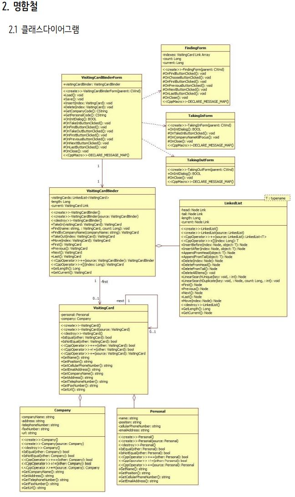
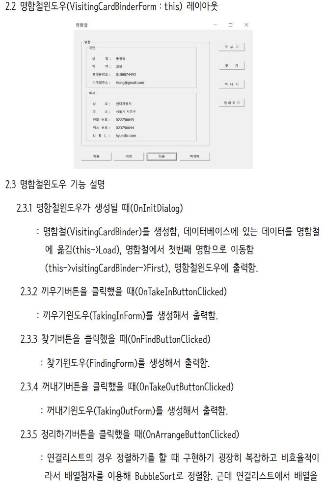
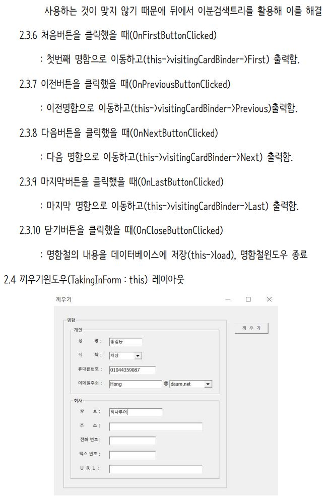
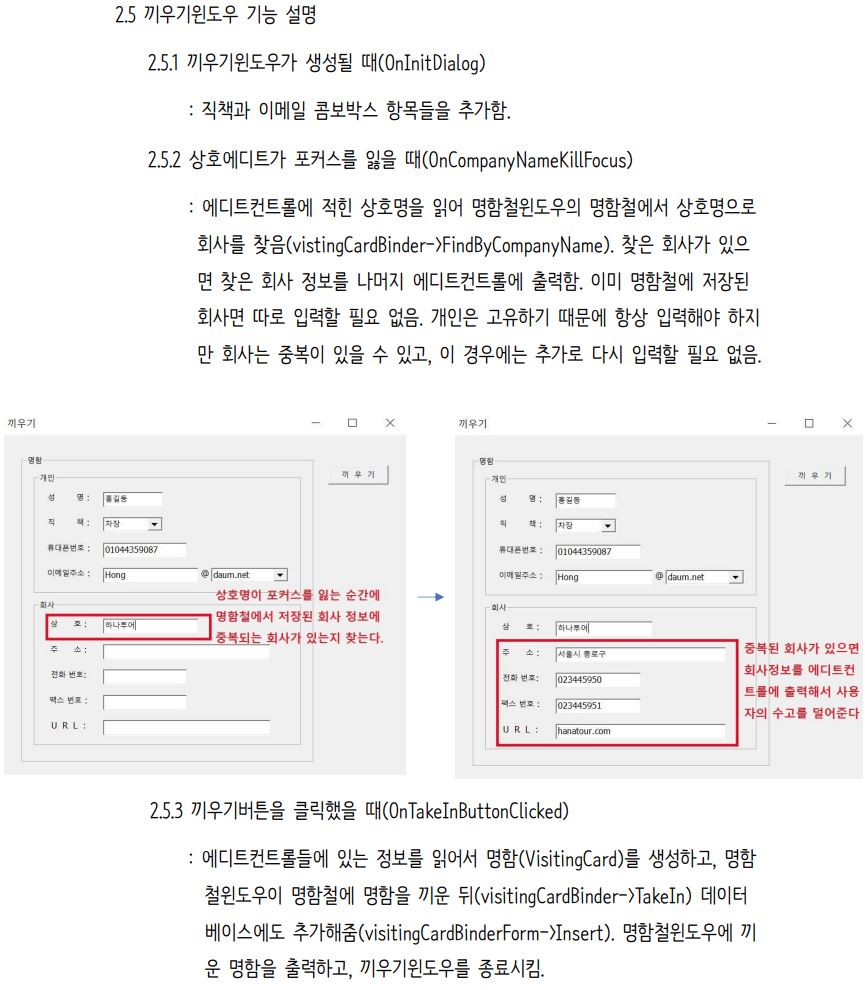
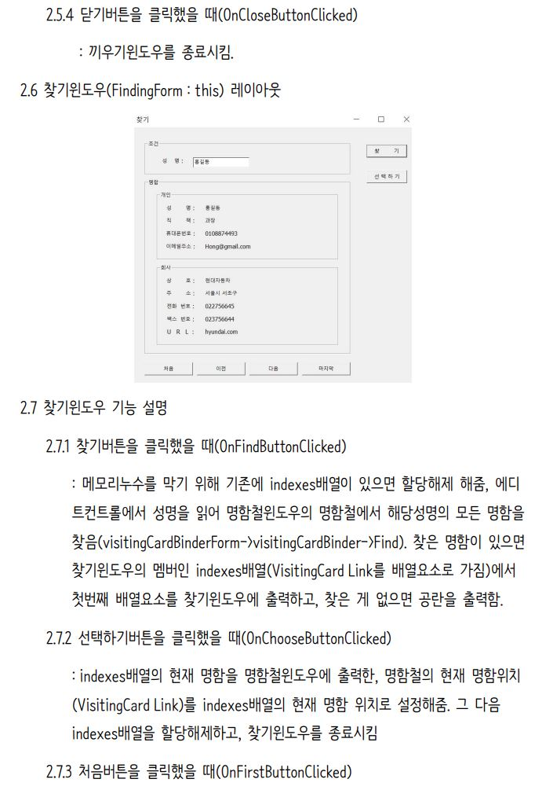
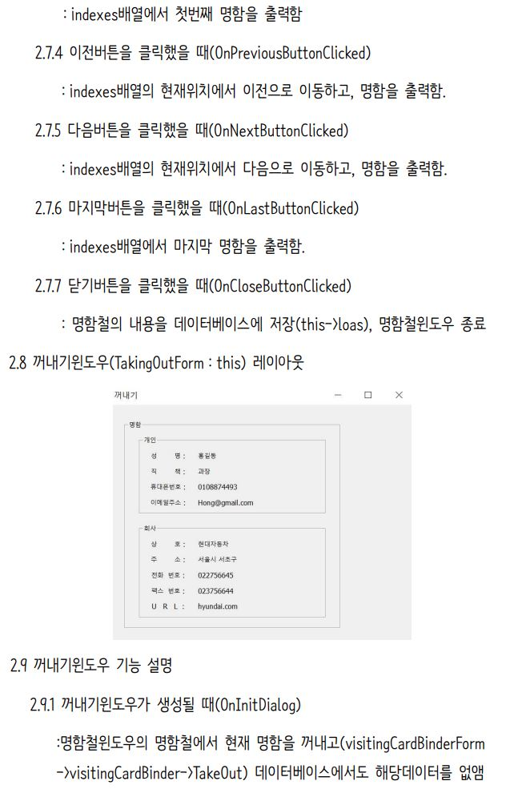
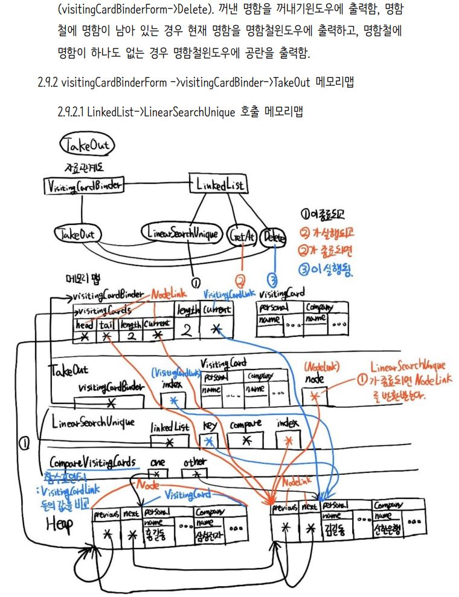
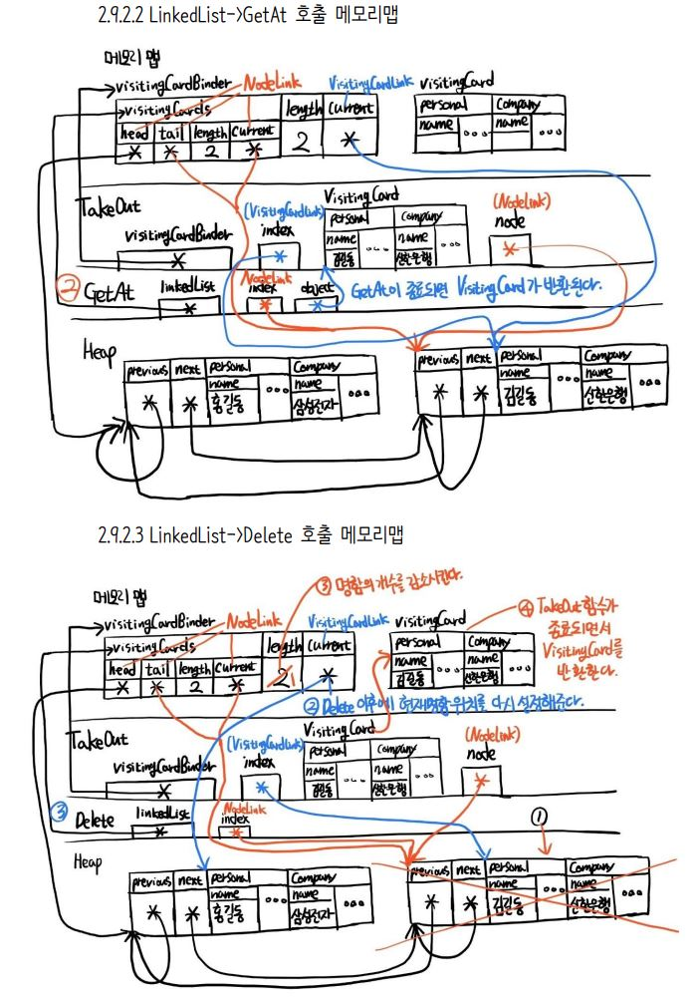
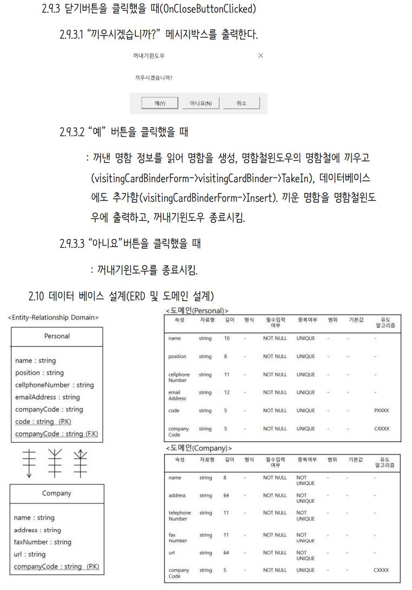
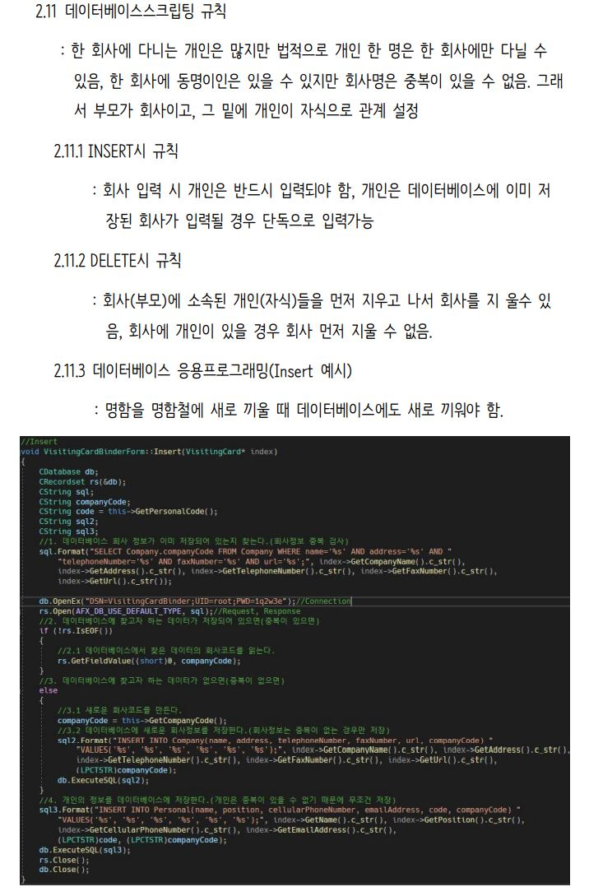

# 명함철(VisitingCardBinder) 프로그램입니다.
## C++로 명함철 프로그램을 구현한 내용을 요약하였습니다.

## C++로 구현한 명함철 프로그램을 자바로 구현하면서 정리한 내용을 개인 블로그에 올렸습니다.
<a href="https://injae7034.github.io/java/fourteenth/" target="_blank">Java프로젝트하면서 Object 메소드 오버라이딩 개념 익히기</a>  
<a href="https://injae7034.github.io/java/fifteenth/" target="_blank">Java프로젝트하면서 LinkedList에서 얕은 복사 깊은 복사 설명하기</a>  
<a href="https://injae7034.github.io/java/sixteenth/" target="_blank">Java프로젝트하면서 입출력에서 RandomAccessFile을 쓰는 이유와 사용 방법 설명하기</a>  
<a href="https://injae7034.github.io/java/seventeenth/" target="_blank">Java프로젝트하면서 테스트하기 위해 콘솔을 이용한 CUI Programming 구현하기(+ 사용자 친화적 설계)</a>  
<a href="https://injae7034.github.io/java/eighteenth/" target="_blank">Java프로젝트하면서 데이터베이스 관계(Foreign Key, INNER JOIN) 설명 및 MySQL과 연동</a>  
